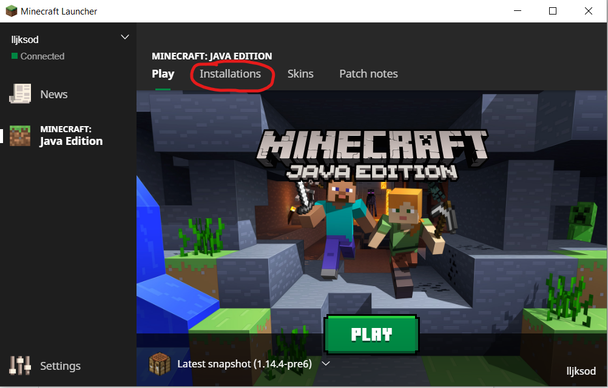

# What you'll need
1. Windows (preferably Windows 10)
2. Minecraft Java Edition Version 1.12.2
3. Minecraft Forge Client (single-player) Version 1.12.2
4. Java version 8
5. RaspberryJam Minecraft Mod
6. Python 3
7. Node.js
8. Internet connection (for cdn packages)

# Setup Minecraft
1. Install Minecraft on target machine
2. Run the Minecraft Launcher
3. Add version 12.1.2 as a selection in the launcher and run that version once.



# Setup Forge and Raspberry Jam Mod
1. Install Java version 8
2. Install Python 3
2. Follow the instructions for installing Forge 12.1.2 and Raspberry Jam at: https://github.com/arpruss/raspberryjammod


# Start Pycrafty
First, install node.js on your system. You can download it at: https://nodejs.org/en/

To verify node is properly installed open up a terminal and type:
```
node -v 
```
You should see a version number displayed in the terminal.

Run ```npm install``` from the folder which holds the Pycrafty code.
This will install any dependencies for the server on the machine.

Next, start a server for Pycrafty by running the command
```
node bin\www
```
in the project root directory.

Then to launch the Pycrafty application go to the address localhost:3000 in a web browser.
You should now see the full work environment.

# Create a script:
Enter the desired file name in the text box with the text "File name" and click 
the Create Script button. It is recommended to use just alphanumeric characters for the file name.
The file should be saved in the appropriate directory.
If no file name is entered in that text box a file named "script.py" is created
instead. 

# Creating and executing a generated script in Minecraft
Assuming a script was created with the file name "file.py"
open up a minecraft chat window and type: 
```
\lpy file.py
```
to run the script in Minecraft.

# Libraries Used
    * Blockly: https://developers.google.com/blockly/
    * node.js: https://nodejs.org/en/
    * express-generator: https://expressjs.com/en/starter/generator.html
    * picnic CSS: https://picnicss.com/
    
